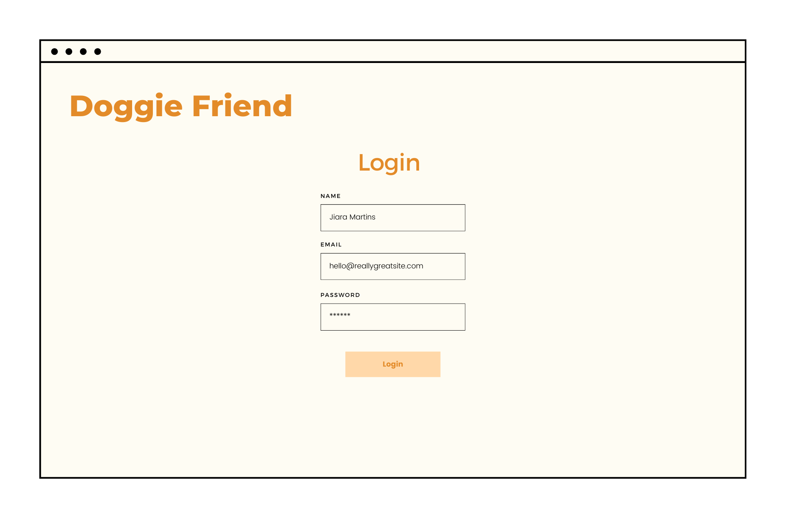
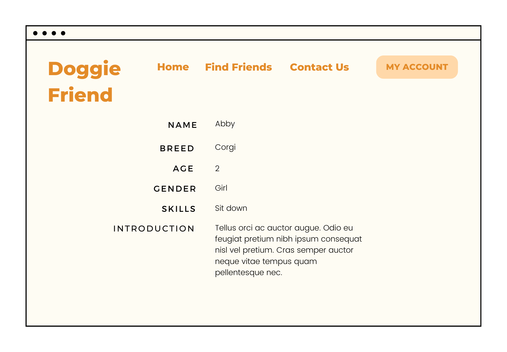

# Doggie Friends

## Overview

Welcome to our Doggie Friend app, where you can connect with other dog lovers and their furry companions! With our easy sign-up and login process, you can create a profile for yourself and add your beloved dog to our community. Explore the app and discover other users and their dogs, share photos and stories(might not be installed in this project, but may in the future...), and make new friends. So what are you waiting for? Join our pack today!


## Data Model

The application will store Users and Dogs


An Example User:

```javascript
{
  username: "Abbymon",
  email: 'hello@reallygreatsite.com',
  hash: // a password hash,
  googleId: //if login by google,
  salt: //added by passport.js
  hash: //added by passport.js
}
```

An Example Dog document, may add image key later..:

```javascript
{
  dogImage: Buffer Image,
  dogImageType:'image/jpeg',
  dogName: 'Argi',
  dogBreed:'Corgi',
  dogAge: 2,
  dogGender:'Girl',
  dogSkills:'Sit',
  dogIntro:'cutie baby',
  user: // a reference to a User object
  slug: 'argi-corgi-2-girl',
  createdAt: //Date 
}
```


## [Link to Commented First Draft Schema](db.mjs) 

click the link above. 

## Wireframes

/home - homepage of the web app


/signup - page for user sign up


/login - page for user login



/find - page for showing all dogs with filters


/dogs/more - page to see detailed information about a specific dog



/add - page for user to add their own dogs


## Site map


## User Stories or Use Cases

1. as non-registered user, I can register a new account with the site
2. as non-registered user, I can find and check dogs, but cannot add dogs 
3. as a user, I can log in to the site
4. as a user, I can add my dogs
5. as a user, I can view all of the dog lists in the database, and check detailed information
6. as a user, I can view all dogs added by me.

## Research Topics

* (2 points) CSS framework - Bootstrap
  * front-end framework that provides a set of pre-built UI components and styles
  * May use it to create user login and registration forms, navbar, carousel slideshow, and buttons.

* (6 points) user authentication - passport.js
  * Passport.js - a popular authentication middleware for Node.js
  * support a wide range of authentication strategies, including username/password and social media login. I implement the local strategy and Google OAuth 2.0.
  
* (1 points) Configuration management - dotenv
  * Use dotenv to store my Google Client ID nd Client Secret

* (1 points) Perform client side form validation using custom JavaScript
  * Checked the user login/registration data is valid, otherwise show error message, e.g. if your registration username already exists
  
* (3 points) API - FilePond
  * Use FilePond to enable image upload and image preview and store the images in MongoDB 

13 points total out of 10 required points.


## [Link to Initial Main Project File](app.mjs) 

Click the link above

## Annotations / References Used

1. [passport.js authentication docs](http://passportjs.org/docs). Specifically for Google Login procedures. 
2. [passport.js passport-local-mongoose example](https://www.geeksforgeeks.org/node-js-authentication-using-passportjs-and-passport-local-mongoose/) For local user login. 
3. [Bootstrap docs](https://getbootstrap.com/docs/4.1/getting-started/introduction/). For basic navbar, carousel slideshow, login forms, buttons, and flex. 
4. [Bootstrap card style](https://codingyaar.com/bootstrap-profile-card-1/). The referenced CSS style for Dogs Cards.
5. [FilePond docs](https://pqina.nl/filepond/). Upload the image with image preview. 
6. [FilePond video](https://www.youtube.com/playlist?list=PLZlA0Gpn_vH8jbFkBjOuFjhxANC63OmXM)
7. [dotenv docs](https://www.npmjs.com/package/dotenv). Store the ID and Secrets in .env file. 
8. [Dog stickers](https://www.flaticon.com/free-stickers/dog). My Corgi stickers on the home page.

